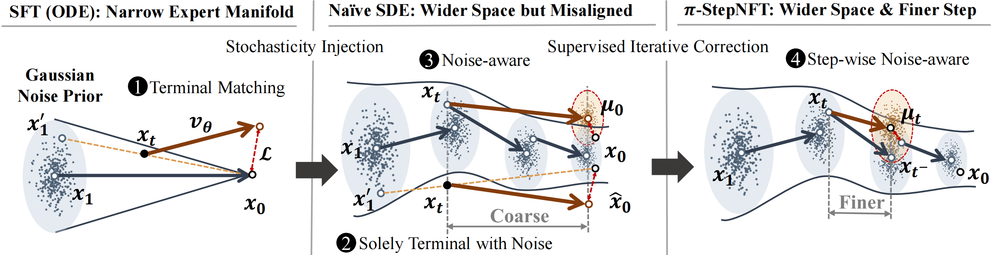

# $\pi$-StepNFT: Wider Space Needs Finer Steps in Online RL for Flow-based VLAs

**Main Results** (see paper for full protocol)
- **LIBERO (few-shot):** $\pi$-StepNFT improves performance by **32.9%** over SFT.
- **ManiSkill (OOD generalization):** $\pi$-StepNFT improves OOD success by **11.1%** over critic-based baselines by mitigating multimodal overfitting.

## Quick Start

For environment setup and simulator configuration details, please refer to the [RLinf](https://github.com/RLinf/RLinf) repository.

### Installation

Run experiments using the Docker image.

```bash
docker run -it --rm --gpus all \
   --shm-size 20g \
   --network host \
   --name rlinf \
   -v .:/workspace/RLinf \
   rlinf/rlinf:agentic-rlinf0.1-maniskill_libero
   # For faster mirror downloads in mainland China, you can use:
   # docker.1ms.run/rlinf/rlinf:agentic-rlinf0.1-maniskill_libero
```

Switch to the corresponding virtual environment using the built-in `switch_env` tool:

```bash
source switch_env openpi
```

For Maniskill,
```
cd <path_to_pi_StepNFT>/rlinf/envs/maniskill
# For faster downloads in mainland China, you can set:
# export HF_ENDPOINT=https://hf-mirror.com
hf download --repo-type dataset RLinf/maniskill_assets --local-dir ./assets
```

### Training

```bash
bash examples/embodiment/run_embodiment.sh libero_object_nft_actor_openpi
```

### Evaluation
```bash
# Batch eval on embodiment checkpoints (auto-scan global_step_* in descending order)
TIMESTAMP=YOUR_TIMESTAMP \
EXP_SUBPATH=maniskill_nft_actor_openpi/checkpoints \
EVAL_NAME=embodiment_${TIMESTAMP} \
MIN_STEP=160 \
bash examples/embodiment/batch_eval_embodiment.sh maniskill_ppo_openvlaoft
```

```bash
# Batch eval on ManiSkill OOD tasks across multiple envs
TIMESTAMP=YOUR_TIMESTAMP \
EXP_SUBPATH=maniskill_nft_actor_openpi/checkpoints \
CONFIG_NAME=YOUR_CFG_NAME \
EVAL_NAME=mani_ood_${TIMESTAMP} \
MIN_STEP=160 \
bash examples/embodiment/batch_eval_mani_ood.sh
```


# $\pi$-StepNFT: Wider Space Needs Finer Steps in Online RL for Flow-based VLAs

<div align="center">
  <a href="https://wangst0181.github.io/pi-StepNFT/"></a>
  <a href='https://arxiv.org/abs/2603.02083'></a>
</div>

$\pi$-StepNFT (Step-wise Negative-aware Fine-Tuning) is a **critic-and-likelihood-free online RL framework** for flow-based vision-language-action (VLA) policies.
Flow-based VLAs rely on multi-step sampling, where action likelihoods are often intractable, hindering online RL.
Moreover, embodied control typically uses a **short denoising path** to meet interaction latency, and prior empirical evidence indicates diminishing returns from moderately longer paths.
To enable exploration, $\pi$-StepNFT adopts a reverse-time SDE formulation that injects stochasticity and yields a wider exploration space (**“Wider Space”**), and we identify that wider exploration spaces necessitate finer-grained, step-wise guidance for alignment (**“Finer Steps”**).
Instead of only supervising the terminal output, we motivate step-wise supervision that targets the **immediate next solver state**, using a **noise-aware regression** signal, and we introduce a logistic contrastive ranking loss with “push-pull dynamics” that maximizes the likelihood of successful trajectories while suppressing failed ones, which **eliminates auxiliary value networks**.
It requires only a single forward pass per optimization step, enabling scalable online adaptation for embodied VLAs.




**Highlights**
- **Critic- and likelihood-free** online RL for flow-based VLAs (no auxiliary value networks).
- **Wider Space:** SDE-based sampling expands the exploration manifold beyond deterministic ODE trajectories.
- **Finer Steps:** step-wise supervision targets the **immediate next denoising step** with a noise-aware regression signal.
- **Penalty-free preference learning:** a **logistic contrastive ranking loss** enforces push–pull dynamics (promote successes, suppress failures) to stabilize on-policy learning.
- **Efficient:** only **one forward pass per optimization step**, reducing training overhead and latency-critical complexity.


**Main Results** (see paper for full protocol)
- **LIBERO (few-shot):** $\pi$-StepNFT improves performance by **32.9%** over SFT.
- **ManiSkill (OOD generalization):** $\pi$-StepNFT improves OOD success by **11.1%** over critic-based baselines by mitigating multimodal overfitting.


## Quick Start

For environment setup and simulator configuration details, please refer to the [RLinf](https://github.com/RLinf/RLinf) repository.

### Installation

Run experiments using the Docker image.

```bash
docker run -it --rm --gpus all \
   --shm-size 20g \
   --network host \
   --name rlinf \
   -v .:/workspace/RLinf \
   rlinf/rlinf:agentic-rlinf0.1-maniskill_libero
   # For faster mirror downloads in mainland China, you can use:
   # docker.1ms.run/rlinf/rlinf:agentic-rlinf0.1-maniskill_libero
```

Switch to the corresponding virtual environment using the built-in `switch_env` tool:

```bash
source switch_env openpi
```

For Maniskill,
```
cd <path_to_pi_StepNFT>/rlinf/envs/maniskill
# For faster downloads in mainland China, you can set:
# export HF_ENDPOINT=https://hf-mirror.com
hf download --repo-type dataset RLinf/maniskill_assets --local-dir ./assets
```

### Training

```bash
bash examples/embodiment/run_embodiment.sh libero_object_nft_actor_openpi
```

### Evaluation
```bash
# Batch eval on embodiment checkpoints (auto-scan global_step_* in descending order)
TIMESTAMP=YOUR_TIMESTAMP \
EXP_SUBPATH=maniskill_nft_actor_openpi/checkpoints \
EVAL_NAME=embodiment_${TIMESTAMP} \
MIN_STEP=160 \
bash examples/embodiment/batch_eval_embodiment.sh maniskill_ppo_openvlaoft
```

```bash
# Batch eval on ManiSkill OOD tasks across multiple envs
TIMESTAMP=YOUR_TIMESTAMP \
EXP_SUBPATH=maniskill_nft_actor_openpi/checkpoints \
CONFIG_NAME=YOUR_CFG_NAME \
EVAL_NAME=mani_ood_${TIMESTAMP} \
MIN_STEP=160 \
bash examples/embodiment/batch_eval_mani_ood.sh
```


## Related Projects
- RLinf: https://github.com/RLinf/RLinf
```bibtex
@article{yu2025rlinf,
  title={RLinf: Flexible and Efficient Large-scale Reinforcement Learning via Macro-to-Micro Flow Transformation},
  author={Yu, Chao and Wang, Yuanqing and Guo, Zhen and Lin, Hao and Xu, Si and Zang, Hongzhi and Zhang, Quanlu and Wu, Yongji and Zhu, Chunyang and Hu, Junhao and others},
  journal={arXiv preprint arXiv:2509.15965},
  year={2025}
}
```

- DiffusionNFT: https://github.com/NVlabs/DiffusionNFT
```bibtex
@article{zheng2025diffusionnft,
  title={DiffusionNFT: Online Diffusion Reinforcement with Forward Process},
  author={Zheng, Kaiwen and Chen, Huayu and Ye, Haotian and Wang, Haoxiang and Zhang, Qinsheng and Jiang, Kai and Su, Hang and Ermon, Stefano and Zhu, Jun and Liu, Ming-Yu},
  journal={arXiv preprint arXiv:2509.16117},
  year={2025}
}
```

## Citation
```bibtex
@misc{wang2026pistepnftwiderspaceneeds,
      title={$\pi$-StepNFT: Wider Space Needs Finer Steps in Online RL for Flow-based VLAs}, 
      author={Siting Wang and Xiaofeng Wang and Zheng Zhu and Minnan Pei and Xinyu Cui and Cheng Deng and Jian Zhao and Guan Huang and Haifeng Zhang and Jun Wang},
      year={2026},
      eprint={2603.02083},
      archivePrefix={arXiv},
      primaryClass={cs.RO},
      url={https://arxiv.org/abs/2603.02083}, 
}
```